# Antenna Models
*Antenna simulation models used in my research project.*

Designed and simulated by **CST 2024 (mostly) and 2025**

---

## Catalog

### Round Patch Antenna (2.09 GHz, PEC, Air)
- [Aperture-Fed 2 slots with T-shape Slots Geometry](#aperture-fed-2-slots-with-t-shape-slots-geometry)
- [Aperture-Fed 2 slots with Г-shape Slots Geometry](#aperture-fed-2-slots-with-г-shape-slots-geometry)
- [Cap-Fed 2 Probes + Quadrature Hybrid Coupler](#cap-fed-2-probes-+-circulator-and-quadrature-hybrid-coupler-+-rat-race)
- [Cap-Fed 2 Probes + Circulator and Quadrature Hybrid Coupler](#cap-fed-2-probes-+-circulator-and-quadrature-hybrid-coupler)
- [Cap-Fed 4 Probes + Rat-Race](cap-fed-4-probes-+-rat-race)
- [Cap-Fed 4 Probes + Circulator and Quadrature Hybrid Coupler + Rat-Race](#cap-fed-4-probes-+-circulator-and-quadrature-hybrid-coupler-+-rat-race)
- [Cap-Fed 4 Probes + T-shape Coupler CST2025](cap-fed-4-probes-+-t-shape-coupler-cst2025)
- [Cap-Fed 4 Probes + 2 Quadrature Hybrid Coupler CST2025](cap-fed-4-probes-+-2-quadrature-hybrid-coupler-cst2025)

### Antenna Array (2.09 GHz, Unit Cell, 2 Probes, PEC, with Fence)
- [Stacked Cap-Fed bottom_sub RO4350B top_sub RO4830](#stacked-cap-fed-bottom_sub-ro4350b-top_sub-ro4830)
- [Stacked noCap-Fed bottom_sub RO4835T top_sub CuClad233](#stacked-nocap-fed-bottom_sub-ro4835t-top_sub-cuclad233)
- [Cap-Fed sub RO4350B 3x3 subArray](cap-fed-sub-ro4350b-3x3-subarray)
- [Cap-Fed sub RO4350B 2x1 subArray](cap-fed-sub-ro4350b-2x1-subarray)
- [Cap-Fed Parallel Contour Matching + Quadrature Hybrid Coupler sub RO4350B](#cap-fed-parallel-contour-matching-+-circulator-and-quadrature-hybrid-coupler-sub-ro4350b)
- [Cap-Fed Chebyshev Filter N2 Matching + Quadrature Hybrid Coupler sub RO4350B](#cap-fed-chebyshev-filter-n2-matching-+-circulator-and-quadrature-hybrid-coupler-sub-ro4350b)
  
### Useful TS-files
- [Ideal Circulator](ideal-circulator)
- [Ideal Quadrature Hybrid Coupler](ideal-quadrature-hybrid-coupler)
- [Ideal Quadrature Hybrid Coupler + Chebyshev Filter N2](ideal-quadrature-hybrid-coupler-+-chebyshev-filter-n2)
- [Ideal Quadrature Hybrid Coupler + Parallel Contour](ideal-quadrature-hybrid-coupler-+-parallel-contour)

---

## Detailed Description

### Round Patch Antenna (2.09 GHz, PEC, Air)

#### Aperture-Fed 2 slots with T-shape Slots Geometry
- **File:** `Round Patch Antenna/roundPatchEps1_apertureFeed_Tshape_msLines_2024.cst`
- **Figures:**
  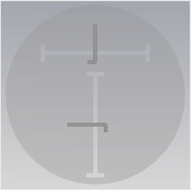

#### Aperture-Fed 2 slots with Г-shape Slots Geometry
- **File:** `Round Patch Antenna/roundPatchEps1_apertureFeed_Г-shape_msLines_2024.cst`
- **Figures:**
  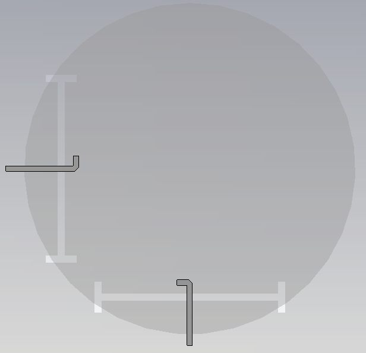

#### Cap-Fed 2 Probes + Quadrature Hybrid Coupler
- **File:** `Round Patch Antenna/roundPatchEps1_capFeedAbove_2024.cst`
- **Figures:**
  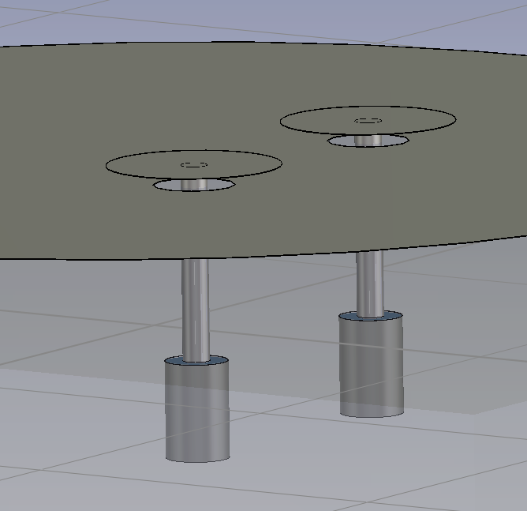 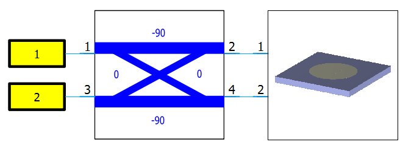

#### Cap-Fed 2 Probes + Circulator and Quadrature Hybrid Coupler
- **File:** `Round Patch Antenna/roundPatchEps1_2probes_capFeedAbove_2024_circulator.cst`
- **Figures:**
   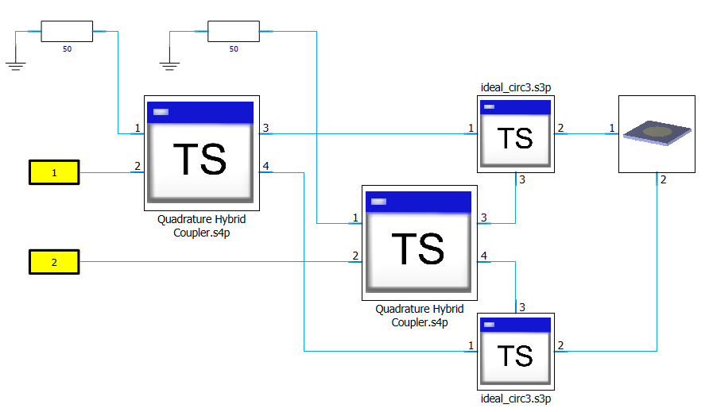

#### Cap-Fed 4 Probes + Rat-Race
- **File:** `Round Patch Antenna/roundPatchEps1_4probes_capFeedAbove_2024.cst`
- **Figures:**
  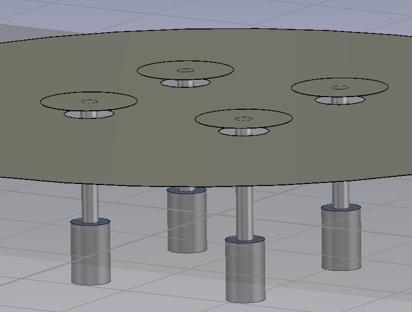 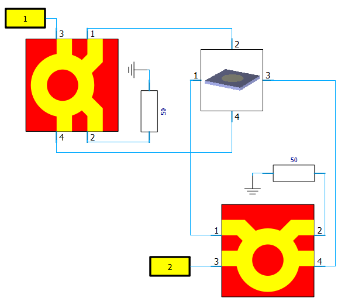

#### Cap-Fed 4 Probes + Circulator and Quadrature Hybrid Coupler + Rat-Race
- **File:** `Round Patch Antenna/roundPatchEps1_4probes_capFeedAbove_2024_circulator+ratRace.cst`
- **Figures:**
   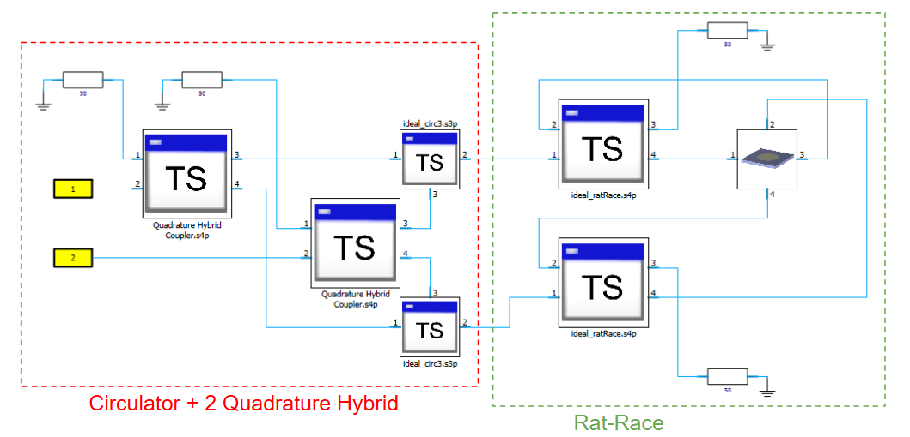

#### Cap-Fed 4 Probes + T-shape Coupler CST2025
- **File:** `Round Patch Antenna/roundPatchEps1_4probes_capFeedAbove_antiphaseCoupling.cst`
- **Figures:**
   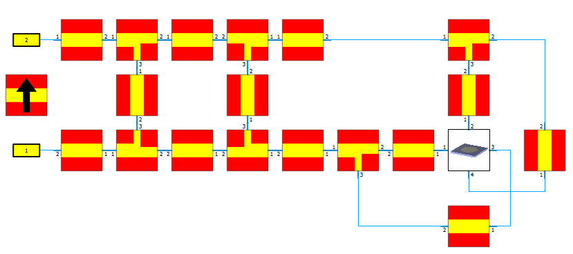

#### Cap-Fed 4 Probes + 2 Quadrature Hybrid Coupler CST2025
- **File:** `Round Patch Antenna/roundPatchEps1_4probes_capFeedAbove_90hybrid.cst`
- **Figures:**
   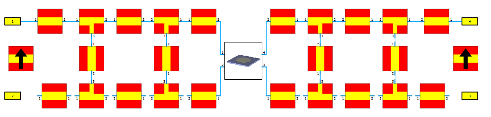

---

### Antenna Array (2.09 GHz, Unit Cell, 2 Probes, PEC, with Fence)

#### Stacked Cap-Fed bottom_sub RO4350B top_sub RO4830
- **File:** `Antenna Array/Array_stackedRoundPatch_capFeed_withFence_2024.cst`
- **Figures:**
  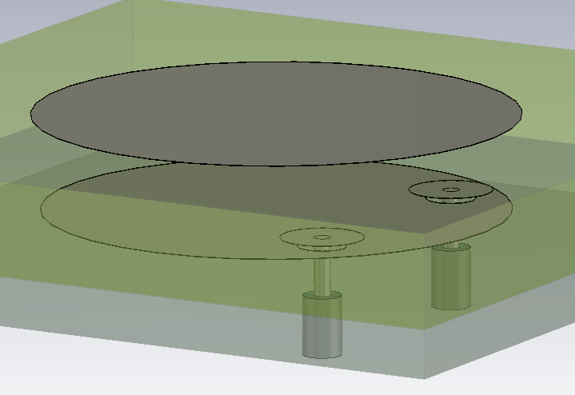

#### Stacked noCap-Fed bottom_sub RO4835T top_sub CuClad233
- **File:** `Antenna Array/Array_stackedRoundPatch_noCap_withFence_2024.cst`
- **Figures:**
  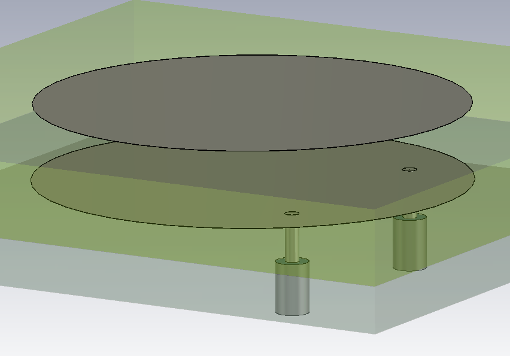

#### Cap-Fed sub RO4350B 3x3 subArray
- **File:** `Antenna Array/Array_RoundPatchEps366_capFeed_withFence_2024.cst`
- **Figures:**
  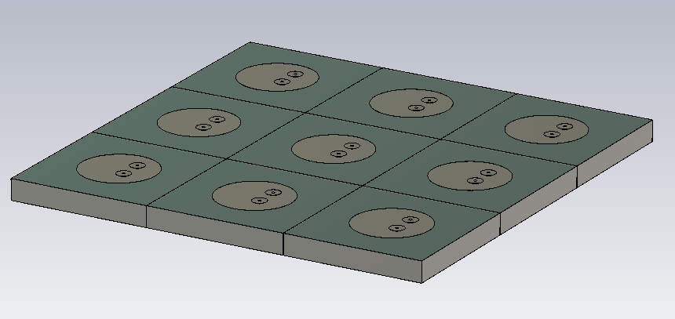

#### Cap-Fed sub RO4350B 2x1 subArray
- **File:** `Antenna Array/Array_2x1_RoundPatchEps366_capFeed_withFence_2024.cst`
- **Figures:**
  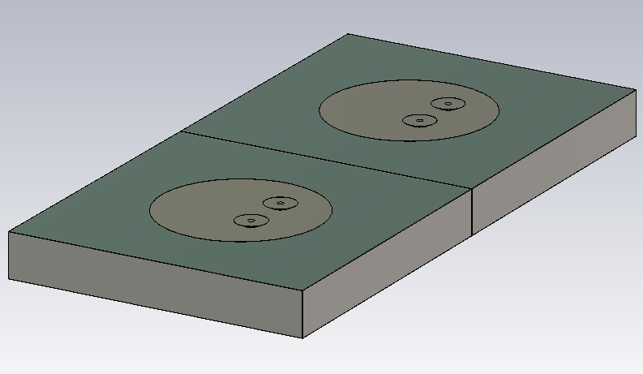

#### Cap-Fed Parallel Contour Matching + Quadrature Hybrid Coupler sub RO4350B
- **File:** `Antenna Array/Array_RoundPatchEps366_capFeed_withFence_paralContourMatching_2024.cst`
- **Figures:**
  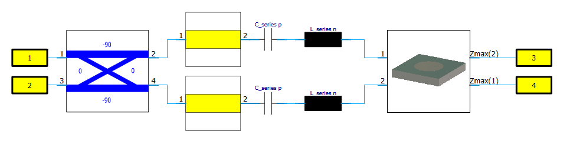

#### Cap-Fed Chebyshev Filter N2 Matching + Quadrature Hybrid Coupler sub RO4350B
- **File:** `Antenna Array/Array_RoundPatchEps366_capFeed_withFence_chebyshevMatchingN2_2024.cst`
- **Figures:**
  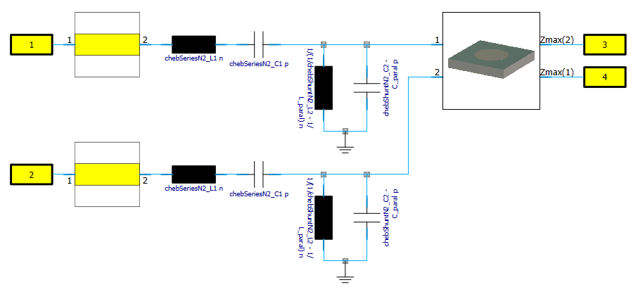
